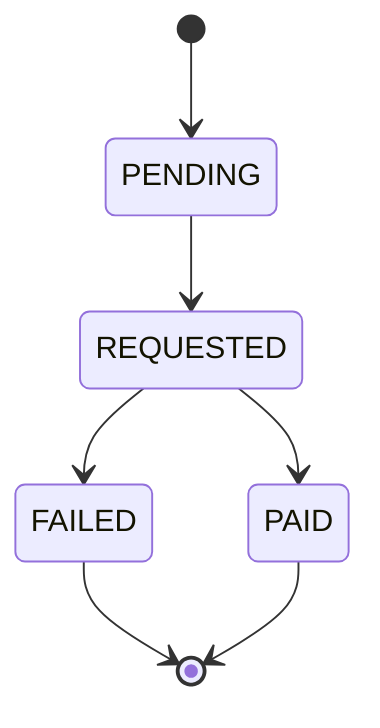
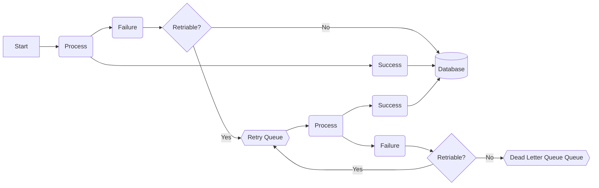
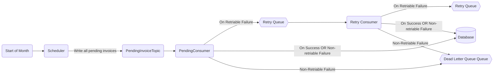

## Solution

Here are the steps I followed throughout my coding.

1. Clone the repo and changed the port from 7000 to 8000 (as 1 of the apple service was causing conflict).
2. I tried to understand the code by drawing module dependencies. 
3. Also, understood `PaymentProvider` interface. I saw it is an external interface, so just followed along and found a todo in BillingService. I see PaymentProvider throws couple of errors and I see only NetworkException can be retried. Rest of them, requires some form of intervention.
4. Later I add `fetchPending` method to InvoiceService to fetch all the pending invoices.
5. Stich Billing and InvoiceService
6. Then I researched about schedulers in Kotlin. Lot of time I found SpringBoot's `@Scheduler` annotation, but that adds a big dependency to project. So, I did further search and found `dev.inmo.krontab` library and used it along with Coroutines which will trigger the payment of invoices.
7. To make this process scalable I used Kafka Messaging System. So, scheduler will push all the invoices to Kafka pending invoices topic where different consumers can then deal with it. Also, load will be higher at the start of the month so service has to be available, and Kafka can definitely scale. Also, it decouples the whole processing keeping the code clean as well.
8. When Scheduler writes on Kafka, it changes the status of invoice to Requested.
8. Now, scheduler writes on the topic, and PendingInvoiceConsumer listens on the topic. This is the flow I am using currently:
    1. If there is success, all is good. We update invoice payment as successful and done with that invoice. We mark invoice as `PAID`
    2. If there are failures, we have to deal with them accordingly.
        a. In case of InventoryId is missing, InvoiceNotFoundException is thrown
        b. In case of missing Customer, CustomerNotFoundException is thrown.  
        c.  `CurrencyMismatchException`: when the currency does not match the customer account.
        d. `NetworkException`: when a network error happens.
        e. `InvoicePaymentFailed` when InvoicePaymentFailed for various other reasons
    3. For now, only NetworkException is retried for `maxRetries` times. Currently I am setting it 3.
    4. Also, retry is done immediately. But we can also write it to `retry queues` and deal with them accordingly.
    5. In case of NetworkExceptions run of all the retries OR in case of other exceptions, we write the message to dead letter queue.
    6. We can either notify our operations team or stakeholders when we see errors with the invoice processing in dead letter queue and try to resolve them. We mark the payment as `FAILED`.

### Invoice Status
Here is the state diagram of Invoice Status:

### Ideal Invoice Processing Flow
1. Try to Process the payment. 
1a. If successful, all good - update the database(DB).
1b. In case of failure, if error is not retriable, save to DB and stop
1c. If retriable, write to retry queue
2. Read from retry queue and try to process. Now follow the steps in 1a, 1b and 1c, till we reach max retries or success, whichever comes first.

### Retry Strategies and Exactly once guarantee
We have to be sure, that each invoice is processed only once, as if we charge 2 times for same invoice, customer's trust will shake. So, we need to follow exactly once guarantee - which can work if somehow get `at least once` and `at most once`. This is where retry strategy become important.

#### Retry strategies and at least once guarantee
Retry provides the at-least-once guarantee. For example, in case invoice is not settled and request keeps failing due to a poor network connection. We can keep retrying in this case till we get success. Here are some strategies:
- Immediate retry: client immediately resends a request.
- Fixed intervals: Retry at a fixed amount of time
- Incremental intervals: client waits for a shorter time at the start, and then incrementally increases the time for subsequent retries.
- Exponential backoff: double the waiting time between retries after each failed retry till some max time
- Cancel: the client can cancel the request in case it knows that the request will anyways be unsuccessful

#### Idempotency and at most once guarantee
We have to make sure that our calls are idempotent, i.e. the result is consistent even when we apply the operation multiple times. When the service tries to settle the same invoice again and again, the payment provider should check if previous call for same ID exists, then it should treat next calls as retries.
### Arch Diagram

### Testing

I added tests for various services in core package, tests for scheduler function and tests for consumer functions as well.

## What could have been better

1. API could be paginated. At the moment we return everything
2. Create separate Billing table with reference to invoice table. This table can be append only table, on top of which we can create a view to show latest snapshot. For eg. suppose we first got the bill with invoice requested; then, the user paid the amount - now we take invoice status of `PAID` as the latest status. Add `date_created` field to track more debuggability and improve retry pipelines.
3. Add retry and dead letter queue to Kafka. 
4. Improve config management
5. Improve logging
